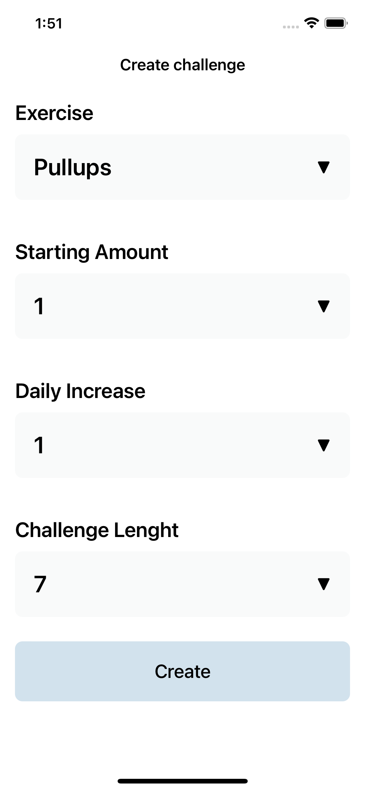
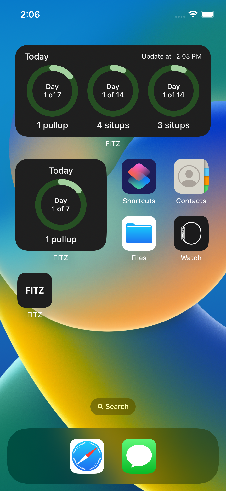

# FITZ

#### An app for creating sporting challenges, tracking their progress and execution.
Contains a premium subscription with the ability to unlock all content, create customised exercises and more customisation
There is support for widgets

## Includes ( ALL SWIFTUI )
- Combine Framework
- Firebase Auth + Database
- Custom Modifiers
- Animations
- Light and Dark Mode
- Widgets
- In app purshase auto-renewable subscription

## Gif

  
 
 

 
## Screenshots

- Landing, Login Screens

  
 

- Main screen, Create challenge
 

   

   
- Profile screens, Paywall

 

   

   
- Widgets
 

   

   
## Author
* [Bogdan Zykov](https://github.com/BogdanZyk)

## License

 Copyright 2022 Bogdan Zykov.
 Licensed under MIT License: https://opensource.org/licenses/MIT
   
